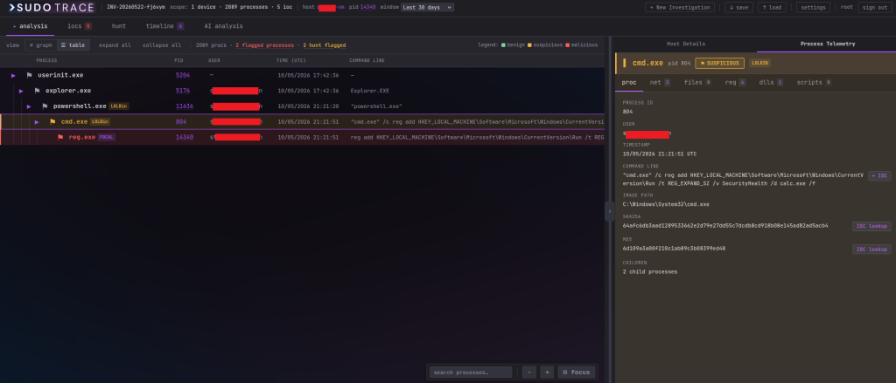
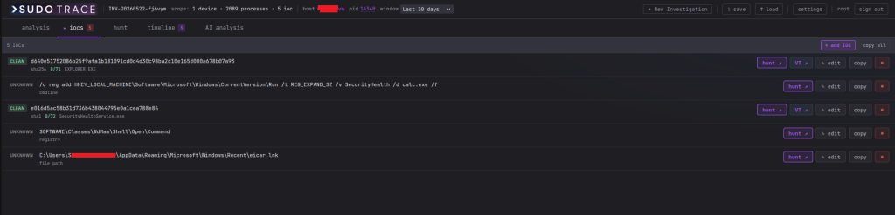
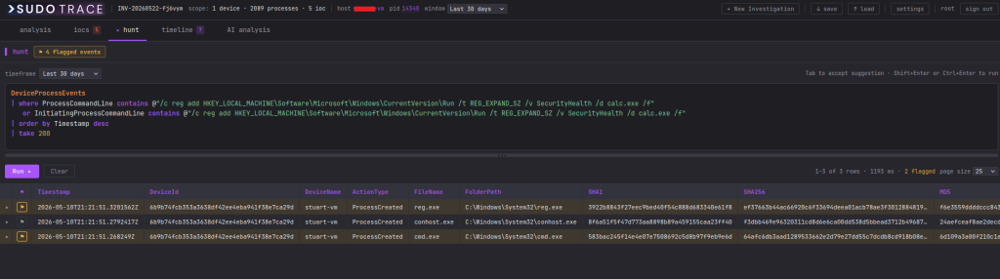
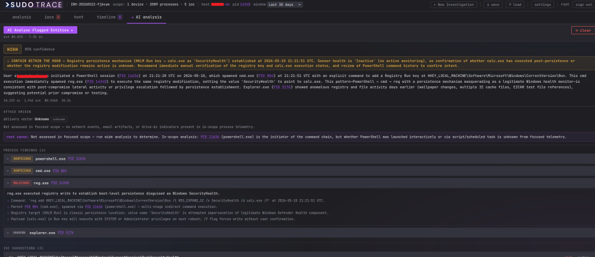
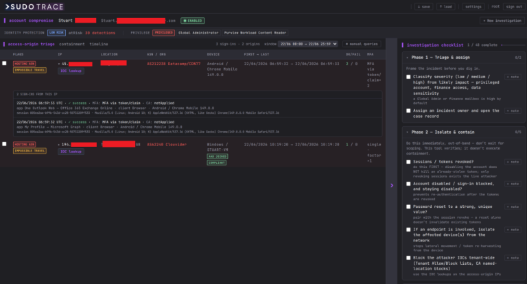
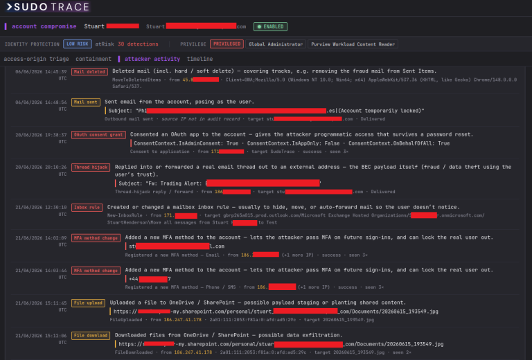
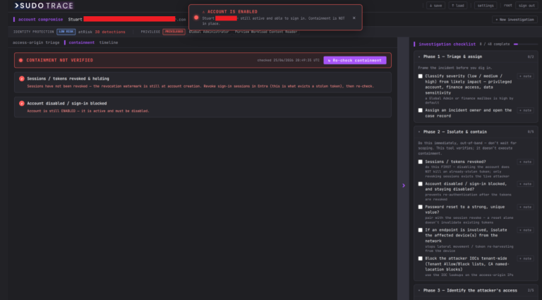
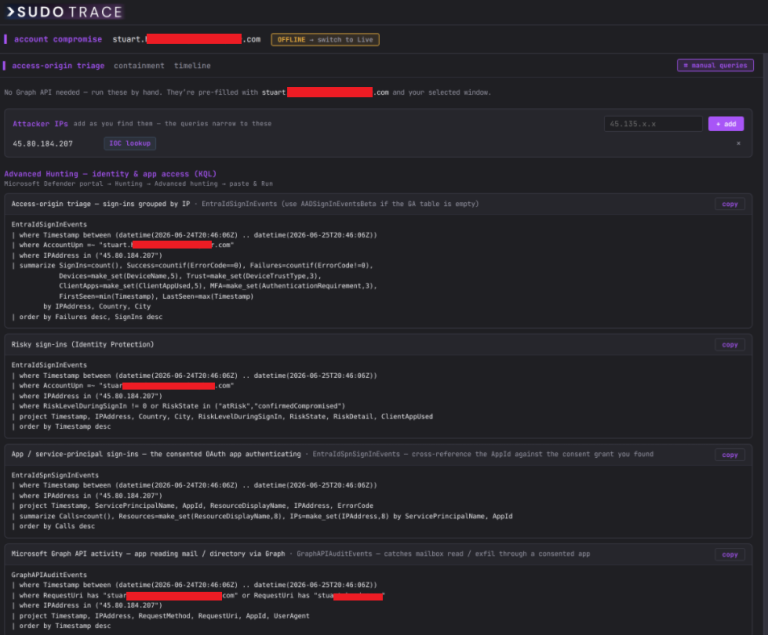

# SudoTrace
https://sudo-savvy.com/sudo-trace/


**Free, self-hosted, AI-powered SOC analyst workbench for Microsoft Defender for Endpoint.**

> It's **not** a SIEM or a monitoring tool — it's an investigation workbench you bring in when you already have something to investigate.

>SudoTrace is a pure investigation and analysis tool. You submit a hostname or device ID and a process ID, and the tool loads your full process ancestry chain alongside telemetry from core MDE tables pulled in parallel via the Graph Security API.
From there, the analyst is in control. You review the process tree, flag the processes that look suspicious or malicious, and confirm the IOCs you want examined. Those flagged items can then be sent to Claude, which analyses the scoped data as a virtual blue team analyst, working backwards from the focal process to find the true root cause, identifying the delivery vector with a confidence level, flagging lateral movement indicators, and producing structured findings that reference exact PIDs, timestamps, and command lines. Every finding is grounded in the actual telemetry you selected.



- Visual process tree with colour-coded flagging — suspicious (amber), malicious (red), benign (green)
- Core telemetry tables loaded in parallel via the Microsoft Graph Security API
- Claude analysis: root cause, delivery vector, attack narrative
- Four investigation tabs — Analysis, IOCs, Hunt, Timeline, AI analysis
- Raw KQL editor with syntax highlighting
- Analyst-confirmed IOC list integrated with VirusTotal for clean/malicious verdicts


Pivot to hunting from your curated IOC list:


Flag events as benign, suspicious, or malicious to build your timeline:


Timeline that can be modified and exported:


The AI will analyse the flagged entities and summarize if the activity is benign or malicious with a confidence level:


---

## Account-compromise / BEC investigation

SudoTrace now extends beyond the endpoint into **identity and Business Email Compromise (BEC) investigation**. Where the endpoint workbench answers *"what did this process do on this host?"*, the account-compromise module answers *"what did the attacker do with this stolen account?"* — reconstructing the whole takeover from Entra sign-in logs, the Unified Audit Log and Identity Protection into a single, readable account-of-events.

Give it a UPN and a time window and it separates the attacker's sessions from the legitimate user's, scopes everything they touched, and drives you through a phased incident-response runbook. It's **read-only** — it verifies and reports; it never executes containment. And it **degrades gracefully**: missing a permission, a licence tier, or Graph access entirely doesn't break it — it falls back to the offline checklist plus copy-paste Advanced Hunting queries.

You open a case with a UPN and choose **Live (Graph API)** or fully **Offline (manual)** mode.

**Access-origin triage** — sign-ins grouped per IP with anomaly flags (AiTM token reuse, impossible travel, hosting/datacentre ASN, legacy auth), one-click VirusTotal lookups, device-trust chips, and an Identity Protection / privilege strip (is this account a Global Admin? at risk?). Any origin expands to the exact individual sign-ins behind it — status, MFA method, app, session id, device:


**What the attacker did, in order** — tick the attacker's origins and scope persistence, mailbox manipulation, recon (which emails/files they read), exfiltration, anti-forensics and the outbound fraud mail. Results are deduplicated and rewritten in plain English, each with the source IP/device. Tick the events that matter to fold them onto a chronological timeline you can edit and export to CSV:


**Containment watcher** — verifies the two invariants that actually matter: sessions revoked *and holding*, and the account disabled (because disabling an account doesn't kill an already-stolen token — only revoking sessions does). Because it re-checks the live account state on every run, it also catches an account that's been silently re-enabled — e.g. by on-prem AD sync in a hybrid tenant. It all sits inside a phased IR checklist (triage → isolate/contain → identify → scope → eradicate → restore → harden → notify → document) that auto-ticks as findings come in:


**No Graph access? No problem.** Offline mode skips Graph entirely and generates copy-paste **Advanced Hunting (KQL)** queries pre-filled with the account and window — add suspicious IPs as you find them and every query narrows to them:


Each case auto-saves and can be exported to a portable JSON file to archive or hand to another analyst.

---

Self-hosted, runs in two Docker containers, talks to your tenant through the Microsoft Graph Security API only.

---

## Quick start

Requires Docker and Docker Compose.

```bash
docker compose up --build      # first run
docker compose up -d           # subsequent runs
docker compose down            # stop (data persists)
docker compose down -v         # destroys all data — use with care
```

Visit **https://localhost** and accept the self-signed certificate warning.

**Default login:** `root` / `root` — forces a password change on first login.

Configuration is then done in the UI (Settings):

- **Microsoft Defender for Endpoint** — paste your Azure AD app registration's tenant ID, client ID,
  client secret. The endpoint workbench needs `ThreatHunting.Read.All`, `SecurityAlert.Read.All` and
  `SecurityIncident.Read.All` with admin consent.
  - **Account-compromise / BEC module** additionally needs `AuditLog.Read.All`, `Directory.Read.All`,
    `AuditLogsQuery.Read.All` and `RoleManagement.Read.Directory`; the Identity Protection enrichment
    needs `IdentityRiskyUser.Read.All` + `IdentityRiskEvent.Read.All` (and Entra ID P2). All BEC features
    degrade gracefully if a permission or licence tier is missing.
- **Claude AI (Anthropic)** — paste an API key from `console.anthropic.com`. There's an always-visible
  disclaimer covering what data leaves your environment.
- **VirusTotal** — optional, free key from `virustotal.com` for hash / IP lookups.

All credentials are encrypted at rest in the SQLite DB inside the Docker volume.

---

## Tech stack

- **Backend** — Python 3.12, FastAPI, httpx, msal, SQLite (WAL mode), Anthropic SDK
- **Frontend** — React 19, TypeScript, Vite, React Flow
- **TLS** — self-signed cert auto-generated into a Docker volume on first run
- **Models** — Claude Haiku 4.5 by default for cost reasons; override per-deployment via
  `CLAUDE_ANALYSIS_MODEL` if needed.

---

## Engineering rules

These are baked into the design and worth knowing before you fork:

- **Microsoft Graph only.** Endpoint hunting goes through `POST graph.microsoft.com/v1.0/security/runHuntingQuery`
  for all KQL. The account-compromise module additionally uses identity-plane Graph endpoints
  (`/auditLogs/signIns`, `/auditLogs/directoryAudits`, the audit-log query API, `/identityProtection/*`,
  `/roleManagement/*`) through the same retried request helper. No non-Microsoft data sources.
- **Ports** bound to `127.0.0.1` only — never `0.0.0.0`. Put a reverse proxy in front for remote access.
- **Credentials** entered through the UI only — no `.env` files, no config files on disk.
- **Errors** show analyst-friendly text; full detail (stack traces, raw Graph responses) stays in the
  audit log.
- **Every AI call** is logged to the `token_usage` table with model, tokens, cost, and duration.

---

## Disclaimer

SudoTrace is analyst-assist tooling. AI-generated summaries, classifications and IOC suggestions are
leads, not verdicts — confirm everything against the underlying telemetry before acting on it. Sending
process trees, command lines, paths, hashes, IPs and analyst notes to Anthropic's API counts as data
egress from your environment; only enable the AI on investigations whose contents may leave your tenancy.

The default `root / root` login is for first-boot only — the UI redirects you to the change-password
page before showing anything else, so a normal browser user can't proceed without setting a new
password. Don't expose the container to the internet without putting authenticated reverse-proxy auth
in front of it.
