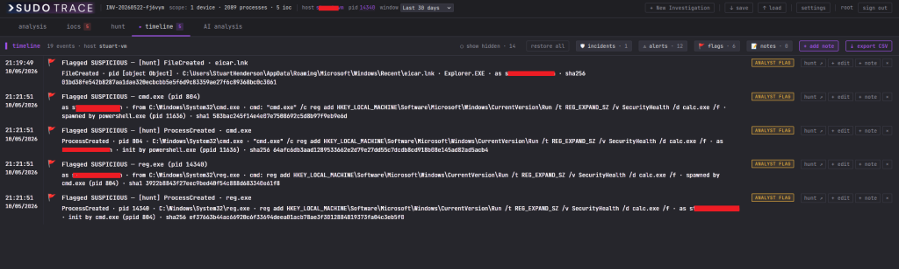

# SudoTrace
https://sudo-savvy.com/sudo-trace/


**AI-powered SOC analyst workbench for Microsoft Defender for Endpoint.**

>SudoTrace is a pure investigation and analysis tool. You submit a hostname or device ID and a process ID, and the tool loads your full process ancestry chain alongside telemetry from core MDE tables pulled in parallel via the Graph Security API.
From there, the analyst is in control. You review the process tree, flag the processes that look suspicious or malicious, and confirm the IOCs you want examined. Those flagged items can then be sent to Claude, which analyses the scoped data as a virtual blue team analyst, working backwards from the focal process to find the true root cause, identifying the delivery vector with a confidence level, flagging lateral movement indicators, and producing structured findings that reference exact PIDs, timestamps, and command lines. Every finding is grounded in the actual telemetry you selected.


- Visual process tree with colour-coded flagging — suspicious (amber), malicious (red), benign (green)
- Core telemetry tables loaded in parallel via the Microsoft Graph Security API
- Claude analysis: root cause, delivery vector, attack narrative
- Four investigation tabs — Analysis, IOCs, Hunt, Timeline, AI analysis
- Raw KQL editor with syntax highlighting
- Analyst-confirmed IOC list integrated with VirusTotal for clean/malicious verdicts


Pivot to hunting from your curated IOC list:


Flag events as benign, suspicious, or malicious to build your timeline:


Timeline that can be modified and exported:


The AI will analyse the flagged entities and summarize if the activity is benign or malicious with a confidence level:


Self-hosted, runs in two Docker containers, talks to your tenant through the Microsoft Graph Security API only.

---

## Quick start

Requires Docker and Docker Compose.

```bash
docker compose up --build      # first run
docker compose up -d           # subsequent runs
docker compose down            # stop (data persists)
docker compose down -v         # destroys all data — use with care
```

Visit **https://localhost** and accept the self-signed certificate warning.

**Default login:** `root` / `root` — forces a password change on first login.

Configuration is then done in the UI (Settings):

- **Microsoft Defender for Endpoint** — paste your Azure AD app registration's tenant ID, client ID,
  client secret. App needs `ThreatHunting.Read.All` and `SecurityIncident.Read.All` with admin consent.
- **Claude AI (Anthropic)** — paste an API key from `console.anthropic.com`. There's an always-visible
  disclaimer covering what data leaves your environment.
- **VirusTotal** — optional, free key from `virustotal.com` for hash / IP lookups.

All credentials are encrypted at rest in the SQLite DB inside the Docker volume.

---

## Tech stack

- **Backend** — Python 3.12, FastAPI, httpx, msal, SQLite (WAL mode), Anthropic SDK
- **Frontend** — React 19, TypeScript, Vite, React Flow
- **TLS** — self-signed cert auto-generated into a Docker volume on first run
- **Models** — Claude Haiku 4.5 by default for cost reasons; override per-deployment via
  `CLAUDE_ANALYSIS_MODEL` if needed.

---

## Engineering rules

These are baked into the design and worth knowing before you fork:

- **MDE access** via Microsoft Graph Security API only — `POST graph.microsoft.com/v1.0/security/runHuntingQuery`
  for all KQL.
- **Ports** bound to `127.0.0.1` only — never `0.0.0.0`. Put a reverse proxy in front for remote access.
- **Credentials** entered through the UI only — no `.env` files, no config files on disk.
- **Errors** show analyst-friendly text; full detail (stack traces, raw Graph responses) stays in the
  audit log.
- **Every AI call** is logged to the `token_usage` table with model, tokens, cost, and duration.

---

## Disclaimer

SudoTrace is analyst-assist tooling. AI-generated summaries, classifications and IOC suggestions are
leads, not verdicts — confirm everything against the underlying telemetry before acting on it. Sending
process trees, command lines, paths, hashes, IPs and analyst notes to Anthropic's API counts as data
egress from your environment; only enable the AI on investigations whose contents may leave your tenancy.

The default `root / root` login is for first-boot only — the UI redirects you to the change-password
page before showing anything else, so a normal browser user can't proceed without setting a new
password. Don't expose the container to the internet without putting authenticated reverse-proxy auth
in front of it.
